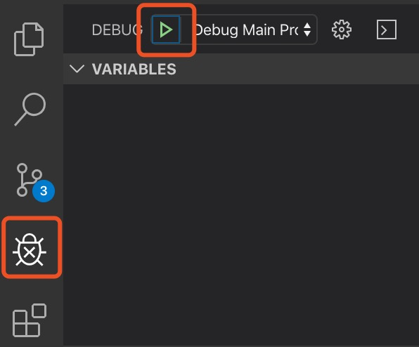

## 关于Electron

### 什么是

[Electron](https://electronjs.org/) 是由 Github 开发，用 HTML，CSS 和 JavaScript 来构建跨平台桌面应用程序的一个开源库。 Electron 通过将 [Chromium](https://www.chromium.org/Home) 和 [Node.js](https://nodejs.org/) 合并到同一个运行时环境中，并将其打包为 Mac，Windows 和 Linux 系统下的应用来实现这一目的。

### 谁在用

### 

github 的 atom 编辑器、微软的 vscode 编辑器，包括阿里内部的一些 软件也是用 electron 开发的

### 核心理念

Electron 的核心理念是：保持 Electron 的体积小和可持续性开发。
如:为了保持 Electron 的小巧 (文件体积) 和可持续性开发 (以防依赖库和 API 的泛滥) ， Electron 限制了所使用的核心项目的数量。
比如 Electron 只用了 Chromium 的渲染库而不是其全部组件。这使得升级 Chromium 更加容易，但也意味着 Electron 缺少了 Google Chrome 里的一些浏览器相关的特性。 添加到 Electron 的新功能应该主要是原生 API。 如果可以的话，一个功能应该尽可能的成 为一个 Node.js 模块。

### 优点

- 开源的核心扩展比较容易，基于，加之现在 gyp 已经非常人性化了，使得 c++ 和 js 配合非常容易。
- 界面定制性强，原则上只要是 Web 能做的它都能做。
- 是目前最廉价的跨平台技术方案，HTML+JS 有大量的前端技术人员储备，而且有海量的现存 web UI 库。
- 相对其他跨平台方案（如 QT GTK+ 等），更稳定，bug 少， 只要浏览器外壳跑起来了，里面的问题不会太多。
- 方便热更新。

### 缺点

- 卡，启动慢，这可能是 webkit 的原因。毕竟一个浏览器要支持的功能太多了。
- 除了主进程，可能还需要启动一些辅助进程来完成工作。而每当新开一个进程，起步价就是一个nodejs的内存开销。
- 丢帧。
- 打出来的包太大。很显然，即便是一个空包，也至少包含了一个浏览器的体积。

## Electron环境的搭建

配置 node 开发环境，安装 npm 。

初始化项目，使用`npm init -y`创建一个基础工程。

运行`npm install --save-dev electron`安装 Electron。

在项目根目录下创建 index.js 文件，这里的文件名要与 package.json 文件中 `main` 的值保持一致，默认为 index.js。

```javascript
const { app, BrowserWindow } = require('electron')

// 保持对window对象的全局引用，如果不这么做的话，当JavaScript对象被
// 垃圾回收的时候，window对象将会自动的关闭
let win

function createWindow () {
  // 创建浏览器窗口。
  win = new BrowserWindow({
    width: 800,
    height: 600,
    webPreferences: {
      nodeIntegration: true
    }
  })

  // 加载index.html文件
  win.loadFile('index.html')

  // 打开开发者工具
  win.webContents.openDevTools()

  // 当 window 被关闭，这个事件会被触发。
  win.on('closed', () => {
    // 取消引用 window 对象，如果你的应用支持多窗口的话，
    // 通常会把多个 window 对象存放在一个数组里面，
    // 与此同时，你应该删除相应的元素。
    win = null
  })
}

// Electron 会在初始化后并准备
// 创建浏览器窗口时，调用这个函数。
// 部分 API 在 ready 事件触发后才能使用。
app.on('ready', createWindow)

// 当全部窗口关闭时退出。
app.on('window-all-closed', () => {
  // 在 macOS 上，除非用户用 Cmd + Q 确定地退出，
  // 否则绝大部分应用及其菜单栏会保持激活。
  if (process.platform !== 'darwin') {
    app.quit()
  }
})

app.on('activate', () => {
  // 在macOS上，当单击dock图标并且没有其他窗口打开时，
  // 通常在应用程序中重新创建一个窗口。
  if (win === null) {
    createWindow()
  }
})

// 在这个文件中，你可以续写应用剩下主进程代码。
// 也可以拆分成几个文件，然后用 require 导入。
```

创建 index.html 文件，在页面中写入适当文字。

在 package.json 的 `scripts` 中创建命令`"start":"electron ."`，`"electron ."` 是`"electron ./index.html"`的简写形式。

运行 `npm run start` 启动项目，即可在打开的 electron 程序中看到刚才在页面中输入的文字。

## Electron打包

目前社区中主要的打包方式分为两种， [electron-packager](https://www.npmjs.com/package/electron-packager) 和 [electron-builder](https://www.electron.build/) 。此处只介绍简单用法，更多 api 请直接参考官网

### electron-packger

运行`npm install -g electron-packager`全局安装打包工具

在 package.json 的 `scripts` 中创建命令 `"packager":"electron-packager ./ --arch=x64 --out ./app --electron-version=6.0.12 --overwrite"` 。

`"./"` 表示打包路径为当前路径。

"`--arch=x64"` 表示包为64位。

`"--out ./app"` 表示打包后的输出路径。

`"--electron-version=6.0.12"` 表示当前 Electron 的版本。

`"--overwrite" `表示再次打包时覆盖之前的包。

如果需要打非当前操作系统的包，需加入 `"--platform=win32"` 打 Windows 的包，`"--platform=darwin"` 打 Mac 的包。

运行`npm run package`打包

### electron-builder

运行 `npm install -g electron-builder` 全局安装打包工具

在 package.json 中增加

```json
"build": {
  "directories": {
    "output": "app" // 表示输出路径
  }
}
```

在package.json的scripts中创建命令，其中`-mwl`表示Mac、Windows和Linux。

```json
"scripts": {
  "builder": "electron-builder -mwl", // 创建各平台的安装包
  "builderUnpacked": "electron-builder --dir -mwl" // 创建各平台的运行程序
}

```

运行`npm run bulder`或`npm run builderUnpacked`打包。

## 主进程与渲染进程通信

创建 renderer.js ，并在 index.html 中引入

在 index.html 中创建两个按钮用来发送同步和异步事件

```html
<button id="sendSync">同步通信</button>
<button id="sendAsync">异步通信</button>
```

在 render.js 中为 `dom` 元素绑定点击事件，分别发送同步和异步消息，在同步消息中弹出返回值。并监听主进程发送的异步消息，弹出值。

```javascript
const { ipcRenderer } = require('electron'); // 引入ipcRenderer
const sendSync = document.querySelector('#sendSync');
const sendAsync = document.querySelector('#sendAsync');

sendSync.onclick = () => alert(ipcRenderer.sendSync('sendSync', '同步传递消息')); // 发送同步消息，返回值是主进程向渲染进程发送的值

sendAsync.onclick = () => ipcRenderer.send('sendAsync', '异步传递消息'); // 发送异步信息

ipcRenderer.on('sendFeedbackSync', (e, data) => alert(data)); // 监听主进程异步消息
```

在 index.js 中监听渲染进程发送的同步消息和异步消息

```javascript
ipcMain.on('sendSync', (e, data) => {
  console.log(data);
  e.returnValue ='来自主进程的同步反馈'; // 同步返回值的方式
});

ipcMain.on('sendAsync', (e, data) => {
  console.log(data);
  e.sender.send('sendFeedbackSync', '来自主进程的异步反馈'); // 异步返回值，发送一个消息
});

```

## 渲染进程间的相互通信

渲染进程之前的相互通信主要有三种方法，第一种是通过设置全局变量，第二种是通过主进程转发，第三种是通过`webContents` 。

### 全局变量方式

首先在 index.html 中创建两个相应的按钮

```html
<button id="sendLS">第一种方式：localStorage</button>
<button id="sendGlobal">第一种方式：global</button>
```

在 index.js 中设置全局变量，定义创建新窗口的函数，监听创建新窗口的消息。

```javascript
const { BrowserWindow, ipcMain } = require('electron');
let newWin;
global.globalObj = { value: 'default' };

const createNewWindow = () => {
  newWin = new BrowserWindow({
    width: 800,
    height: 600,
    webPreferences: {
      nodeIntegration: true
    }
  });
  newWin.loadFile('new.html');
  newWin.webContents.openDevTools();
  newWin.on('closed', () => {
    newWin = null;
  });
}

ipcMain.on('createNewWindow', () => createNewWindow());

```

在 renderer.js 中为两个按钮绑定相应的事件

```javascript
const { ipcRenderer, remote } = require('electron');
const sendLS = document.querySelector('#sendLS');
const sendGlobal = document.querySelector('#sendGlobal');

sendLS.onclick = () => {
  localStorage.setItem('value', 'localStorage跨组件传值'); // 将值设置在localStorage中
  ipcRenderer.send('createNewWindow');
}

sendGlobal.onclick = () => {
  remote.getGlobal('globalObj').value = 'global跨组件传值'; // 通过remote修改预先定义好的global中的值
  ipcRenderer.send('createNewWindow');
}
```

在 new.html 对应的 js 文件中获取值。

```javascript
const { remote } = require('electron');

alert(localStorage.getItem('value')); // 从localStorage中读取值

alert(remote.getGlobal('globalObj').value); // 通过remote从global获取值
```

### 主进程转发方式

首先在 index.html 中创建两个相应的按钮

```html
<button class="createNewWindow">创建新窗口</button>
<button id="sendMain">第二种方式：主进程转发</button>
```

在 renderer.js 中为两个按钮绑定相应的事件

```javascript
const { ipcRenderer } = require('electron');
const createNewWindow = document.querySelectorAll('.createNewWindow');
const sendMain = document.querySelector('#sendMain');

for (let i = 0; i < createNewWindow.length; i++) {
  createNewWindow[i].onclick = () => ipcRenderer.send('createNewWindow');
}

sendMain.onclick = () => ipcRenderer.send('sendMain', '通过主进程转发跨组件传值');
```

在 index.js 中监听相应的消息，获取消息后再通过 `webContents` 的方式转发给新建的窗口。

```javascript
const { ipcMain } = require('electron');

ipcMain.on('sendMain', (e, data) => newWin.webContents.send('sendMain', data));
```

在新建的页面中添加监听消息，获取后弹出消息

```javascript
const { ipcRenderer } = require('electron');

ipcRenderer.on('sendMain', (e, data) => alert(data));
```

### webContents方式

首先在 index.html 中创建两个相应的按钮

```html
<button class="createNewWindow">创建新窗口</button>
<button id="sendWeb">第三种方式：webContents</button>
```

在 renderer.js 中为两个按钮绑定相应的事件

```javascript
const { ipcRenderer } = require('electron');
const createNewWindow = document.querySelectorAll('.createNewWindow');
const sendWeb = document.querySelector('#sendWeb');
const { BrowserWindow } = remote;

for (let i = 0; i < createNewWindow.length; i++) {
  createNewWindow[i].onclick = () => ipcRenderer.send('createNewWindow');
}

sendWeb.onclick = () => {
  const newWindow = BrowserWindow.fromId(2); // 第一个渲染进程的id是1，第二个是2，以此类推
  newWindow.webContents.send('sendWeb', '通过webContents跨组件传值')
}
```

在新建的页面中添加监听消息，获取后弹出消息

```javascript
const { ipcRenderer } = require('electron');

ipcRenderer.on('sendWeb', (e, data) => alert(data));
```

以上是三种渲染进程通讯的方式，第一种由事件驱动，并在主进程中统一管理，为最优解。其他两种方式使用与否视业务需要而定。

## 使用IDE对Electron主进程及渲染进程debug

### 主进程debug

下载[vscode](https://code.visualstudio.com)并创建一个工作空间

在根目录下创建`.vscode/launch.json`写入配置项

```json
{
  "version": "0.2.0",
  "configurations": [
    {
      "name": "Debug Main Process",
      "type": "node",
      "request": "launch",
      "cwd": "${workspaceRoot}",
      "runtimeExecutable": "${workspaceRoot}/node_modules/.bin/electron",
      "windows": {
        "runtimeExecutable": "${workspaceRoot}/node_modules/.bin/electron.cmd"
      },
      "args": [
        "."
      ],
      "outputCapture": "std"
    }
  ]
}
```

点击主进程文件中的行号添加断点

点击左侧“瓢虫”按钮，在点击开始按钮进行 debug



### 渲染进程debug

在主进程创建窗口的函数中添加`win.webContents.openDevTools()` 。

在渲染进程的代码中添加`console.log()` 。

重新打开页面在控制台中查看弹出的值。

## 搭建electron-vue脚手架

把 Electron 和 vue 框架结合在一起形成一个工程，社区中有很多优秀的脚手架工具，其中最流行的两个是SimulatedGRE的 [electron-vue](https://github.com/SimulatedGREG/electron-vue) 和 [Vue CLI Plugin Electron Builder](https://www.npmjs.com/package/vue-cli-plugin-electron-builder) 。

### electron-vue

首先看 electron-vue ，它把 Electron 和 vue 组合在一起写成了一个demo的形式放在了 GitHub 上，初始化项目时`gitclone`即可。但是打开项目地址，Latest commit 8fae476 on 23 Oct 2018，项目中的主要依赖项 Vue.js 停留在了2.5.16，Electron 停留在了2.0.4，项目基本处于废弃状态。  随着 Node.js 版本的不断迭代，项目中的代码可能存在着无法修复的 bug ，所以不再建议继续使用。

### Vue CLI Plugin Electron Builder

另外一个项目初始化的工具是 Vue CLI Plugin Electron Builder ，用法非常友好，先创建一个 Vue.js 项目，在通过混入的方式将 electron 集成进 Vue.js 项目中。

首先全局安装 vue-cli，运行`npm install -g @vue/cli`。

安装完成后先初始化一个 Vue.js 工程`vue create electronjs` 。具体配置项参考[官网](https://cli.vuejs.org/zh/)，在此不作过多展开。

初始化完成后进入项目，运行`vue add electron-builder`来增加 Electron。

全都完毕后 `npm run electron:serve` 进入开发模式，该模式支持热更新。

开发完成后 `npm run electron:build` 进行打包。

## Electron的页面跳转以及新窗口的打开机制

Electron 中页面跳转基本分为3种方式。

1. 页面中的`a`标签的`href`属性跳转，和在浏览器中跳转除无法前进后退外没有太大区别。

   ```html
   <a href="http://www.cgtn.com">第一种跳转方式</a>
   ```

2. 页面中的`a`标签的`href`属性跳转，`taget=_blank`时，点击`a`标签时会发现，新打开了选项卡，原来的页面依然存在。

   ```html
   <a href="http://www.cgtn.com" target="_blank">第二种跳转方式</a>
   ```

3. 由于在electron中绝大部分dom事件都会失效，所以要采用electron中新建窗口的方式。

   新建一个vue页面，在页面中添加`a`标签，为其绑定点击事件。

   ```vue
   <template>
     <a href="javascript:void(0);" @click="createWindow">第三种跳转方式</a>
   </template>
   ```

   在渲染进程中引入 `remote` ，用来在渲染进程中调用主进程的方法。

   ```vue
   <scripts>
     const { BrowserWindow } = require('electron').remote;
     let win;
     
     export default {
       name: 'page',
       methods: {
         createWindow: () => {
           win = new BrowserWindow({
             width: 800,
             height: 600
           });
           win.loadURL('https://www.cgtn.com');
           win.on('close', () => win = null);
         }
       }
     }
   </scripts>
   
   ```

   这种方式和第二种方式的效果是一样的，都新建了一个选项卡。其实这种方式的本质是创建了一个渲染进程。

## 单页面应用的开发模式

用vue脚手架工具可以直接初始化一个带有`vue-router`的项目。但在初始化时，`vue-cli`会询问`Use history mode for router? (Requires proper server setup for index fallback in production)`时，此选项建议填`n`，相当于`react`中的`hash router`。

由于应用中没有像浏览器一样的前进与后退按钮，所以应当给每个页面增加菜单栏，避免点入死链接。

## Electron会话机制

`Electron`提供了`session`来管理浏览器会话、 cookie 、缓存、代理设置等。可以用 cookie 来存储临时全局数据

在主进程中通过`Session`的`cookies`属性来访问`Cookies`的实例

### 存储cookie

设置一个 cookie，使用设置的名称。如果存在，则会覆盖原先 cookie。

```javascript
const cookie = { url: 'https://www.cgtn.com', name: 'name', value: 'value' }
session.defaultSession.cookies.set(cookie)
  .then(() => {}, error => console.error(error));
```

### 获取cookie

查询所有 cookie

```javascript
session.defaultSession.cookies.get({})
  .then(cookies => console.log(cookies))
  .catch(error => console.log(error));
```

查询所有与设置的 URL 相关的所有 cookies

```javascript
session.defaultSession.cookies.get({ url: 'https://www.cgtn.com' })
  .then(cookies => console.log(cookies))
  .catch(error => console.log(error));
```

## Electron关于系统api调用

### CPU

在主进程文件中添加代码，每隔10秒在控制台中弹出一次 CPU 使用状态

```javascript
setInterval(() => console.log(process.getCPUUsage()), 10000);
```

在控制台中会返回一个`CPUUsage`对象

```javascript
{ percentCPUUsage: 0, idleWakeupsPerSecond: 0 }
{ percentCPUUsage: 0.014446632144342482, idleWakeupsPerSecond: 1 }
{ percentCPUUsage: 0.006067459451374693, idleWakeupsPerSecond: 1 }
{ percentCPUUsage: 0.0039493598363823075, idleWakeupsPerSecond: 1 }
{ percentCPUUsage: 0.0028311274694028336, idleWakeupsPerSecond: 1 }
```

`CPUUsage`对象

- `percentCPUUsage`自上次调用 getCPUUsage 以来使用的 CPU 百分比。第一次调用返回0。
- `idleWakeupsPerSecond`数字-自上次调用 getCPUUsage 以来, 每秒平均空闲 cpu wakeups 数。第一次调用返回0。将总是在窗口返回0。

### 内存

在主进程中创建`getMemoryInfo`函数

```javascript
const getMemoryInfo = () => {
  const memoryInfoPromise = process.getProcessMemoryInfo(); // getProcessMemoryInfo方法返回一个promise对象
  memoryInfoPromise.then(memoryInfo => console.log(memoryInfo)); // 该promise对象的参数包含了内存的使用信息
}
```

在electron初始化完成之后每隔10秒调用该函数

```javascript
app.on('ready', async () => setInterval(() => getMemoryInfo(), 10000));
```

在控制台中会返回一个`ProcessMemoryInfo`对象

```javascript
{ private: 47120, shared: 948 }
{ private: 44128, shared: 948 }
{ private: 44132, shared: 948 }
{ private: 44136, shared: 948 }
{ private: 44136, shared: 948 }
```

`ProcessMemoryInfo`对象

- `privateBytes`整数--其他进程(如JS堆或HTML内容)不共享的内存量。

- `sharedBytes`整数-进程之间共享的内存量，通常是由电子代码本身消耗的内存量。

请注意，所有统计数据都以千字节为单位。

### 网络

在主进程中创建`getNetInfo`函数

```javascript
const getNetInfo = () => {
  const request = net.request('https://www.cgtn.com');
  request.on('response', (response) => {
    console.log(`STATUS: ${response.statusCode}`); // 弹出网络状态码
    console.log(`HEADERS: ${JSON.stringify(response.headers)}`); // 弹出头部消息
    response.on('data', chunk => console.log(`BODY: ${chunk}`)); // 弹出页面详情
    response.on('end', () => console.log('No more data in response.'));
  })
  request.end();
}
```

在electron初始化完成之后调用该函数得到所需信息

```javascript
app.on('ready', async () => getNetInfo());
```

## 从剪贴板中复制和粘贴数据

操作剪贴板主要用到的是`clipboard`对象，该对象有读取和写入剪贴板的方法。

### 复制粘贴文本

在页面中创建一段文字、粘贴的按钮和供粘贴的  `input`

```vue
<p @click="handleMsgClick">点击信息复制</p>
<button @click="handleBtnClick">粘贴</button>
<br/>
<input ref="inputText" type="text"/>
```

为文字和按钮绑定点击事件

```javascript
export default {
  methods: {
    handleMsgClick: e => {
      clipboard.writeText(e.target.innerHTML); // 将文字写入剪贴板
    },
    handleBtnClick() {
      this.$refs.inputText.value = clipboard.readText(); // 读取剪贴板的文字
    }
  }
}
```

### 复制粘贴图片

在页面中创建一个复制按钮，和一个没有路径的 `img` 标签

```vue
<button @click="handleImgClick">复制图片</button>
<br/>

```

为按钮绑定事件

```javascript
const { ipcRenderer, remote } = require('electron');
const { clipboard, nativeImage } = remote;

export default {
  methods: {
    handleImgClick() {
      const image = nativeImage.createFromPath('./md_src/1571621650957.jpg'); // 创建一个图片对象
      clipboard.writeImage(image); // 将图片对象写入剪贴板
      const imgSrc = clipboard.readImage().toDataURL(); // 将图片对象从剪贴板中读取，并转成base64格式
      this.$refs.image.src = imgSrc; // 给img标签赋值
    },
  }
}
```

其中用到了 `nativeImage` ，在Electron中, 对所有创建 images 的 api 来说, 您可以传递文件路径或 `NativeImage` 实例。当传递 `null` 时, 将创建一个空的image 对象。

## Electron的本地存储方案

Electron 主进程中是不能获取到浏览器的 `window` 对象的，所以我们不能像在渲染进程中一样使用浏览器为我们提供的 `localstorage` 对象。

建议选用社区中的 `electron-localstorage` 来进行本地数据持久化。该插件中的 `localStorage` 和网页中的 `localStorage` 并不是一回事，也不能互相调用。它的实现方式是在将需要存储的数据存入本地的一个文件中，取用的时候读取此文件。

运行 `npm install --save electron-localstorage` 在项目中安装插件

在主进程中引入插件

```javascript
const storage = require('electron-localstorage');
```

### 保存本地设置

以保存页面关闭时的宽高为例。在页面将要退出时存储页面窗口的信息。

```javascript
app.on('window-all-closed', () => storage.setItem('windowSize', win.getSize())); // 获取当前打开窗口的尺寸，返回一个数组，形式为[width, height]，存入storage
```

修改创建窗口的一部分代码。

```javascript
function createWindow() {
  const windowSize = storage.getItem('windowSize'); // 从storage中取值
  const width = windowSize[0] ? windowSize[0] : 800; // 若storage中没有值，则默认设为800
  const height = windowSize[1] ? windowSize[1] : 600; // 若storage中没有值，则默认设为600

  win = new BrowserWindow({
    width: width, 
    height: height, 
    webPreferences: {
      nodeIntegration: true
    }
  });
}
```

在每次打开程序，创建窗口前会先从 storage 中读取，直到 storage 中的值被清空，运行 `storage.clear()` 清空数据。

### 保存账号和密码

在页面中创建账号和密码输入框，以及一个保存按钮

```vue
<label>用户名：</label>
<input ref="username" type="text">
<br>
<label>密码：</label>
<input ref="password" type="password">
<br>
<button @click="saveUserInfo">保存</button>
```

为按钮绑定保存账号密码的事件，页面渲染完成之后发送通知主进程的消息，并监听主进程返回的消息。

```javascript
const { ipcRenderer } = require('electron');
export default {
    mounted() {
      this.handleMounted(); // 页面渲染完成后通知主进程
      ipcRenderer.once('getUserInfo', (e, data) => {
        const { username, password } = data;
        this.$refs.username.value = username;
        this.$refs.password.value = password;
      }); // 只在页面加载完成后渲染一次
    },
    methods: {
      saveUserInfo() {
        const username = this.$refs.username.value;
        const password = this.$refs.password.value;
        ipcRenderer.send('saveUserInfo', {username, password}); // 获取账号和密码，发送给主进程
      },
      handleMounted: () => ipcRenderer.send('mounted') // 将页面渲染完成的消息通知给主进程
    }
  }
```

在主进程初始化完成后监听渲染进程的消息

```javascript
import { ipcMain } from 'electron';

const storage = require('electron-localstorage');

app.on('ready', async () => {

  ipcMain.on('saveUserInfo', (e, data) => storage.setItem('userInfo', data)); // 监听保存用户信息的消息，并存入storage中

  ipcMain.on('mounted', e => e.sender.send('getUserInfo', storage.getItem('userInfo'))); // 监听渲染进程发送的 mounted 消息，接收到后从 storage 中读取，返回给渲染进程

});
```

这样就实现了数据的持久化，每次打开程序时，只要不清空 storage ，用户名和密码都会赋值给相应的表单。

## Electron应用代码更新

因为项目初始化时集成了 `electron-builder` ，所以应用更新可以采用 `electron-updater` 的方式。

在项目中运行 `npm install --save electron-updater` 安装更新程序

在渲染进程中发送事件通知主进程获取更新

```javascript
const { ipcRenderer } = require('electron');

ipcRenderer.send('checkForUpdate');
```

在主进程中引入更新插件并监听渲染进程发送的请求更新消息

```javascript
import {autoUpdater} from 'electron-updater';

app.on('ready', async () => {
  autoUpdater.setFeedURL({
    provider: "generic",
    url: "https://newstest.cgtn.com/event/echarts-demo/dist_electron/" // 最新程序包存放的地址
  });

  ipcMain.on('checkForUpdate', () => {
    //执行自动更新检查
    autoUpdater.checkForUpdates(); // 获取更新
  })
});
```

运行程序，可以从服务器中获取更新，但是由于我没有苹果开发者账号，不能给包签名，所以无法再进行下面的调研。

## Electron拖拽文件并获取文件详情

在页面中添加拖拽后的放置区域，以及文件详情的显示位置。放置区域一定要阻止 `drgaenter` 和 `dragover` 的默认事件，否则 `drop` 不会触发

```vue
<div class="drop" @dragenter.prevent @dragover.prevent @drop="handleFileDrop">拖拽文件至此处</div>
<div>
  <p>文件名： {{filename}}</p>
  <p>文件大小： {{fileSize}}</p>
  <p>文件内容：{{fileContent}}</p>
</div>
```

为放置区域增加适当的样式方便调试。

```vue
<style scoped>
  .drop {
    width: 100px;
    height: 100px;
    background: red;
  }
</style>
```

引入 `fs` 用来读取文件的详情。

```javascript
const fs = require('fs');

export default {
  data: () => ({
    filename: '',
    fileSize: '',
    fileContent: ''
  }),
  methods: {
    handleFileDrop(e) {
        e.preventDefault();
        const file = e.dataTransfer.files[0]; // 获取拖进来的第一个文件
        this.filename = file.name; // 获取文件名
        this.fileSize = file.size; // 获取文件大小
        fs.readFile(file.path, 'utf8', (err, data) => { // 用node读取文件
          this.fileContent = data; // 将文件内容赋值给fileContent
        });
      }
  }
}
```

最后将电脑中任意一个文本文件拖入红色区域，在下方会显示文件名、文件大小和文件内容。